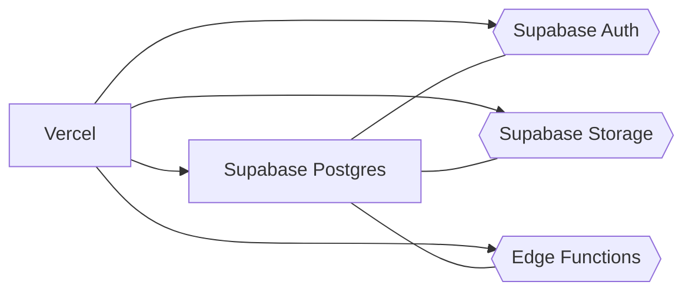
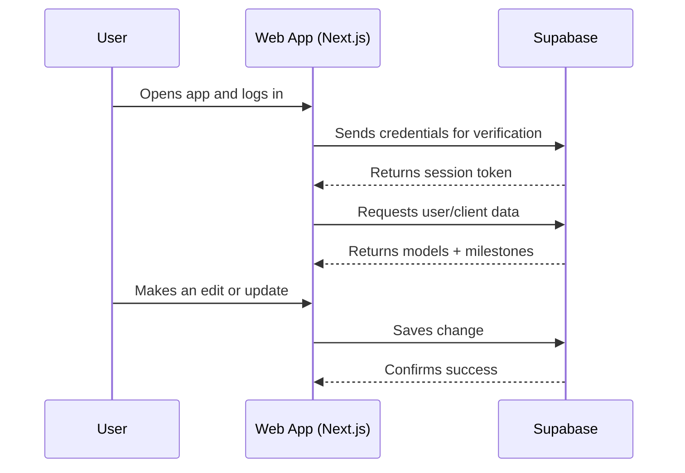

## Architecture (Phase 0)
## Components

Web App: Next.js hosted on Vercel

Backend: Supabase (Auth, Database, Storage, Edge Functions)

Optional: External APIs later

## Diagram (components)

## Login → Load Data → Save Flow

---

Boundaries (simple rules)

Authentication lives in Supabase.

Data lives in Supabase Postgres.

The web app only communicates through Supabase APIs.

Row-Level Security (RLS) ensures users see only their own data.

Non-functional notes

Security: turn on RLS before launch.

CI: GitHub Actions runs build + tests on each PR.

Logging: use console output for early debugging.

Links

Discovery: docs/discovery-brief.md
